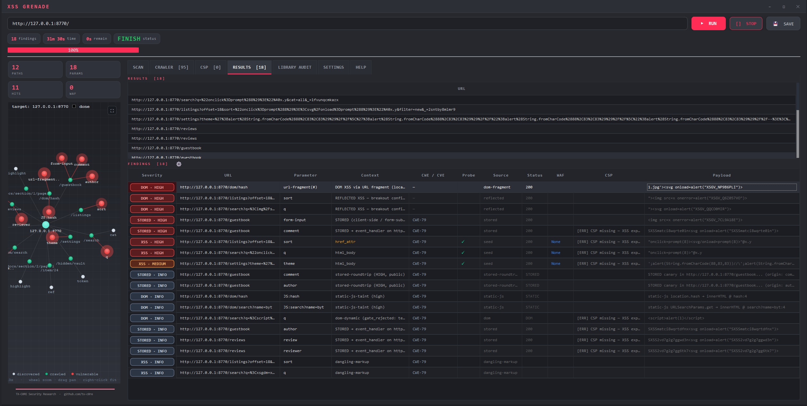

# XSS Grenade

A sophisticated, modern XSS detection engine for authorized security testing and bug-bounty research. XSS Grenade goes well beyond reflected-payload fuzzing: it does context-aware injection, real-browser headless verification to cut false positives, static JavaScript taint analysis, and detection of modern client-side vulnerability classes (DOM XSS, mutation XSS, prototype pollution, DOM clobbering, Trusted Types misconfig, SSR hydration issues, and known-CVE libraries).

It runs as a PyQt5 desktop application — a live attack-surface graph, real-time findings, browser verification, and one-click reports, all from the GUI.



> ⚠️ **Authorized use only.** This tool is for testing systems you own or have explicit written permission to test (e.g. an in-scope bug-bounty program or a signed engagement). Unauthorized scanning is illegal in most jurisdictions. You are responsible for how you use it.

---

## Highlights

- **Context-aware payload selection** — detects *where* a parameter reflects (HTML / attribute / URL / JS / style / comment) and tests only the payloads that fit that context, including multiple reflection contexts for the same parameter.
- **Headless verification** — confirms candidate findings in a real Chromium browser (via Playwright) so the report contains exploitable issues, not noise.
- **Static JS taint analysis** — parses JavaScript into an AST and traces untrusted sources (`location.*`, `document.referrer`, `window.name`, `postMessage` data, …) to dangerous sinks (`innerHTML`, `eval`, `document.write`, framework sinks).
- **Modern vulnerability classes** — DOM XSS, mutation XSS (mXSS), prototype pollution → gadget chains, DOM clobbering, Trusted Types misconfiguration, SSR hydration, CSP-bypass analysis.
- **High-value bug-bounty vectors** — `postMessage` handlers with missing/weak `origin` validation, JSONP callback injection, dangling-markup (scriptless, CSP-resistant) injection, and SVG/XML content-type reflection.
- **Known-CVE library detection** — fingerprints front-end libraries/frameworks (React, Vue, Angular, Next.js, React Router, jQuery, lodash, DOMPurify, …) and flags versions with known XSS/RCE CVEs.
- **Resilient long scans** — atomic, fingerprinted checkpoints let an interrupted scan resume instead of starting over.
- **Reporting** — one-click **SAVE** exports a machine-readable JSON, a self-contained client-ready HTML report (severity summary, deduplicated findings, remediation), and a PoC bundle.

---

## Requirements

- **Python 3.8+**
- Required: `PyQt5` (the GUI), `requests`, `beautifulsoup4`, `alive-progress`
- Strongly recommended: `esprima` (static JS analysis), `playwright` + Chromium (headless verification)
- Optional: `curl_cffi` (TLS fingerprint evasion)

The recommended/optional dependencies degrade gracefully — if one is missing, the related detection feature is disabled and the rest of the tool keeps working. `pip install -r requirements.txt` installs everything.

---

## Installation

```bash
# 1. Clone
git clone https://github.com/tX-c0re/xss-grenade.git
cd xss-grenade

# 2. (Recommended) create a virtual environment
python3 -m venv venv
source venv/bin/activate        # Windows: venv\Scripts\activate

# 3. Install dependencies
pip install -r requirements.txt

# 4. (Recommended) install the Chromium browser for headless verification
playwright install chromium
```

---

## Quick start

Launch the app:

```bash
python xss_grenade_gui.py
```

Then:

1. Enter a **target URL** you are authorized to test.
2. Pick the detection modules you want in the **Settings** tab (context-aware reflected XSS and crawling are on by default).
3. Press **RUN** — watch the live attack-surface graph and real-time findings.
4. Press **SAVE** to export a JSON + HTML report and a self-contained PoC bundle.

Findings are confirmed in a real browser, so the results are exploitable issues, not noise.

---

## Detection modules

XSS Grenade runs a pipeline of phases. Reflected/context-aware XSS and crawling are on by default; the rest are opt-in toggles in the **Settings** tab, so you only pay for what you need.

| Area | Phase / toggle | What it does |
|------|--------------|--------------|
| Crawl | `crawl` (default) | Discovers URLs, query params, forms, JSON bodies, and REST/SPA endpoints from JS bundles. |
| Reflected XSS | `context` (default) | Context-aware payloads per reflection point (HTML/attr/URL/JS/style), incl. multiple contexts. |
| Fuzzing | `--fuzz` | WAF-aware payload mutation when context-aware testing isn't enough. |
| Stored XSS | `--stored`, `--stored-roundtrip` | Detects persisted/round-trip stored XSS. |
| DOM XSS | `--dom`, `--dom-v` | Runtime + static source→sink taint analysis. |
| Static JS | `--static-js` | AST taint analysis of JavaScript bundles and inline scripts. |
| postMessage | `--postmessage` | Flags `message` handlers that flow `event.data` to a sink with missing or weak `origin` validation. |
| Mutation XSS | (automatic) | Sanitizer-bypass / re-parse (mXSS) analysis; runs when the module is available. |
| Prototype pollution | `--proto-pollution` | Client-side PP sources → known library gadget chains → XSS. |
| DOM clobbering | `--dom-clobbering` | Named-element clobbering that hijacks script behavior. |
| Trusted Types | `--trusted-types` | Insecure CSP Trusted Types config + unsafe `createPolicy()`. |
| SSR hydration | `--ssr-hydration` | Server-side-render / hydration XSS issues. |
| CSP bypass | `--csp-bypass` | JSONP-whitelist bypass, `unsafe-inline`/`eval`, missing `base-uri`, nonce reuse, wildcard hosts. |
| Library CVEs | (with `--static-js`) | Fingerprints libraries/frameworks and flags versions with known CVEs. |
| Open redirect → XSS | `--open-redirect` | `javascript:` redirect chains. |
| JSONP injection | `--jsonp-scan` | `?callback=` reflected as a function call in a JS content-type response. |
| Dangling markup | `--dangling-scan` | Unclosed-tag markup-swallowing (scriptless, works even under CSP). |
| SVG / XML XSS | `--svg-scan` | Reflection into `image/svg+xml` / `application/xml` that executes on direct access. |
| WebSocket | `--websocket` | WebSocket message-injection XSS. |
| Headers / CORS | `--headers`, CORS/CRLF/XSSI | Header-reflected XSS, CORS misconfig, CRLF, XSSI. |

Every module above is a checkbox in the GUI's **Settings** tab, with a plain-English explanation in the **HELP** tab.

---

## Reports

The **SAVE** button writes a report bundle to a folder of your choice, anytime — even mid-scan or after a stop, so findings are never lost:

- **JSON** — `findings` (confirmed, deduplicated), a `summary` block with a severity breakdown, plus per-category structured findings. Ideal for tooling.
- **HTML** — a single self-contained file (inline CSS, no external assets) with a severity summary, findings grouped critical-first, per-context remediation, and a vulnerable-library table. All values are HTML-escaped, so the report opens safely even when it contains live payloads.
- **PoC bundle** — a self-contained, inert proof-of-concept page for each confirmed finding.

---

## Safety notes

- **Destructive mode** is gated behind explicit confirmation and is off by default. Only use it where you have permission to trigger state-changing actions.
- **SSRF scanning** is opt-in for the same reason.
- The tool follows a single dedup + verification chokepoint before reporting, so the same issue across many URLs collapses to one finding.

---

## Project layout

```
xss_grenade.py            # Core scan engine (pipeline, phases, reporting)
xss_grenade_gui.py        # PyQt5 graphical interface
context_engine.py         # Reflection-context classification
_static_js_analyzer.py    # JavaScript AST taint analysis
_dom_v6.py                # DOM XSS (runtime hooks + static)
_mutation_xss.py          # Mutation XSS payloads/analysis
_proto_pollution_analyzer.py  # Prototype pollution → gadget chains
_dom_clobbering.py        # DOM clobbering
_trusted_types_analyzer.py    # Trusted Types / CSP audit
_template_injection.py    # Client-side template injection (framework-aware)
_library_cve_feed.py      # Library/framework fingerprinting + CVE matching
_dompurify_cve_feed.py    # DOMPurify version → CVE feed
_open_redirect.py         # Open-redirect → XSS
_headless_verifier.py     # Playwright headless verification
_checkpoint.py            # Resume/checkpoint
_html_report.py           # HTML report generation
bench_firingrange/        # Google Firing Range benchmark harness (Apache-2.0)
```

---

## Contributing

Issues and pull requests are welcome. When adding a detection module, please include a regression test and keep risky/active scanning behind an explicit opt-in flag.

---

## License

XSS Grenade is free software licensed under the **GNU General Public License v3.0** — see [LICENSE](LICENSE) for the full text.

You may use, study, share, and modify it. If you distribute a modified version, you must release your changes under the GPLv3 as well, so the tool stays free and open for everyone.

    XSS Grenade — a modern XSS detection engine for authorized security testing.
    Copyright (C) 2026  TX-C0RE Security Research

    This program is free software: you can redistribute it and/or modify
    it under the terms of the GNU General Public License as published by
    the Free Software Foundation, either version 3 of the License, or
    (at your option) any later version.

    This program is distributed in the hope that it will be useful,
    but WITHOUT ANY WARRANTY; without even the implied warranty of
    MERCHANTABILITY or FITNESS FOR A PARTICULAR PURPOSE.  See the
    GNU General Public License for more details.

    You should have received a copy of the GNU General Public License
    along with this program.  If not, see <https://www.gnu.org/licenses/>.

The bundled Firing Range benchmark corpus under `bench_firingrange/templates/` is derived from Google's Firing Range and is licensed under Apache License 2.0 (see `bench_firingrange/LICENSE.firing-range`), which is compatible with GPLv3.

---

## Disclaimer

XSS Grenade is provided for lawful, authorized security testing and education only. The authors accept no liability for misuse or for any damage caused by this software. Always obtain explicit permission before testing any system you do not own.
